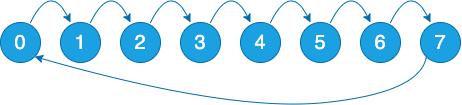

# Overivew

## Introduction
mpiP is a light-weight profiling library for MPI applications. Because it only collects statistical information about MPI functions, mpiP generates considerably less overhead and much less data than tracing tools. All the information captured by mpiP is task-local. It only uses communication during report generation, typically at the end of the experiment, to merge results from all of the tasks into one output file.

## Download
The current version of mpiP can be accessed at https://github.com/LLNL/mpiP/releases/latest.

# Setup on CoolMUC2
We use openmpi in this entire demo.
```bash
module unload intel-mpi
module load openmpi
```

## Method 1: build manually
To build the mpiP from source, start by cloning the mpiP repository from GitHub. Then, run the ./configure script specifying mpicc as the C compiler, mpifort as the Fortran compiler, and including the libunwind paths in the compiler and linker flags. Finally, compile the source code using the `make` command, which will build the mpiP executable and its necessary components.
This creates `libmpiP.so` shared library.

```bash
cd $HOME
git clone https://github.com/LLNL/mpiP.git
cd mpiP

export UNWIND_LIB=/dss/dsshome1/lrz/sys/courses/vihps/2024/tools/mpip/spack/opt/spack/linux-sles15-haswell/gcc-11.2.0/libunwind-1.6.2-vlhsvxtgnqkgfun7rzybup375a6jfv3m/lib
export UNWIND_INC=/dss/dsshome1/lrz/sys/courses/vihps/2024/tools/mpip/spack/opt/spack/linux-sles15-haswell/gcc-11.2.0/libunwind-1.6.2-vlhsvxtgnqkgfun7rzybup375a6jfv3m/include

./configure CC=mpicc F77=mpifort CFLAGS="-g -I$UNWIND_INC" LDFLAGS="-L$UNWIND_LIB"

make
```

## Method 2: pre-built library with spack
Start mpiP setup with the appropriate module environment.

```bash
module unload intel-mpi
module use /dss/dsshome1/lrz/sys/courses/vihps/2024/tools/mpip/spack/share/spack/modules/linux-sles15-haswell
module load mpip
```
The shared library sits at the following path, in case you need to preload it:

`/dss/dsshome1/lrz/sys/courses/vihps/2024/tools/mpip/spack/opt/spack/linux-sles15-haswell/gcc-11.2.0/mpip-3.5-7ug4u7cdsdto4s6xr42bbc7wbxtcazh6/lib/libmpiP.so` 

## Method 3: build with spack on CoolMUC2
Alternatively, you can build mpiP with all the dependencies using Spack. First clone the Spack repository and navigate to the spack/bin directory. 
Add the GCC compiler to Spack's list mpiP.

```bash
git clone -c feature.manyFiles=true https://github.com/spack/spack.git
cd spack/bin

module unload intel-mpi
module load gcc
spack compiler add

./spack -d install -v mpip %gcc@11.2.0
./spack load mpip
```

# Demos

Copy the demo source codes into your home directory.

```bash
cp -r /lrz/sys/courses/vihps/2024/tools/mpip/mpip_demos $HOME/
cd mpip_demos
```

## Demo #1
In this demo, we use a ping-pong communication example, where pairs of processes (`-np`) send a payload back and forth in multiple rounds (`-i`).

<div style="text-align: center;">
  
</div>

Let's build the ping-pong source code, `demo1.c`, on the frontend of CoolMUC2.
```bash
mpicc -o demo1 -O0 -g demo1.c
```

Now, let's run and profile it. The instruction is for interactive jobs, but you can also modify the provided `job.cmd` batch file to run the application.
```bash
# run interactively
module load salloc_conf/cm2_tiny
salloc -J mpip-hands-on --nodes=1 --partition=cm2_tiny --time 00:30:00 --reservation=hhps1s24

# why this? Hint: `cat /proc/sys/kernel/randomize_va_space`
setarch `uname -m` -R /bin/bash

# simply run demo1 with mpip preloaded
LD_PRELOAD=$HOME/mpiP/libmpiP.so mpirun --map-by socket --bind-to hwthread --report-bindings -np 8 ./demo1 -i 10 -p
cat $(ls -t | head -n1)

# added MPIP="-k 3 -n -y"
LD_PRELOAD=$HOME/mpiP/libmpiP.so MPIP="-k 3 -n -y" mpirun --map-by socket --bind-to hwthread --report-bindings -np 8 ./demo1 -i 10 -p
cat $(ls -t | head -n1)

# MPIP="-k 5 -n -y": larger stackdepth
LD_PRELOAD=$HOME/mpiP/libmpiP.so MPIP="-k 5 -n -y" mpirun --map-by socket --bind-to hwthread --report-bindings -np 8 ./demo1 -i 10000
cat $(ls -t | head -n1)

# MPIP="-k 5 -n -y": larger table size
LD_PRELOAD=$HOME/mpiP/libmpiP.so MPIP="-k 5 -n -y -s4096" mpirun --map-by socket --bind-to hwthread --report-bindings -np 8 ./demo1 -i 10000
cat $(ls -t | head -n1)
```

## Demo #2
In this demo, we use a ring communication example, where each rank sends a payload to next neighbor rank (`rank+1`) in multiple rounds (`-i`). Here we use `MPI_Pcontrol()` to limit the scope of profiling to a certain iteration.

<div style="text-align: center;">
  
</div>

Let's build the ring communication source code, `demo2.c`, on the frontend of CoolMUC2.
```bash
mpicc -o demo2 -O0 -g demo2.c
```

Now, let's run and profile it. 
```bash
module load salloc_conf/cm2_tiny
salloc -J mpip-hands-on --nodes=1 --partition=cm2_tiny --time 00:30:00 --reservation=hhps1s24
setarch `uname -m` -R /bin/bash
LD_PRELOAD=$HOME/mpiP/libmpiP.so MPIP="-k 8 -n -s40960 -y -c -z" mpirun --map-by slot --bind-to hwthread --report-bindings -np 8 ./demo2
```

## Demo #3
In this demo, we use mpiP to profile OSU micro-benchmarks, which feature a series of MPI benchmarks that measure the performances of various MPI operations, including Point-to-Point, Collective, and One-sided operations. 

Let's build it on the frontend of CoolMUC2.
```bash
cd $HOME
git clone https://github.com/forresti/osu-micro-benchmarks.git
cd osu-micro-benchmarks/
./configure CC=mpicc CXX=mpicxx
make # by default compilation with debug information is enabled
```

Now, let's run and profile a few microbenchmarks on the compute nodes.
```bash
salloc -J mpip-hands-on --nodes=1 --partition=cm2_tiny --time 00:30:00 --reservation=hhps1s24
setarch `uname -m` -R /bin/bash

# why -c added here: MPIP="-k 5 -n -s4096 -y -c"?
LD_PRELOAD=$HOME/mpiP/libmpiP.so MPIP="-k 5 -n -s4096 -y -c" mpirun --map-by slot --bind-to hwthread --report-bindings -np 56 ./mpi/pt2pt/osu_mbw_mr
cat $(ls -t | head -n1)

LD_PRELOAD=$HOME/mpiP/libmpiP.so MPIP="-k 5 -n -s4096 -y" mpirun --map-by socket --bind-to hwthread --report-bindings -np 2 ./mpi/one-sided/osu_get_bw
cat $(ls -t | head -n1)

LD_PRELOAD=$HOME/mpiP/libmpiP.so MPIP="-k 5 -n -s4096 -y -c" mpirun --map-by slot --bind-to hwthread --report-bindings -np 56 ./mpi/collective/osu_ialltoallv
cat $(ls -t | head -n1)

LD_PRELOAD=$HOME/mpiP/libmpiP.so MPIP="-k 5 -n -s4096 -y -c" mpirun --map-by slot --bind-to hwthread --report-bindings -np 56 ./mpi/collective/osu_ibarrier
```

## Demo #4
LULESH (Livermore Unstructured Lagrangian Explicit Shock Hydrodynamics) is originally defined and implemented by LLNL as one of five challenge problems in the DARPA UHPC program. It is a widely studied proxy application for HPC. It has been ported to a number of programming models including MPI. Here we look at communication profile of LULESH.

Let's build LULESH on the frontend of CoolMUC2.
```bash
git clone https://github.com/LLNL/LULESH.git
sed -i 's/mpig++/mpicxx/g' Makefile
make # by default compilation with debug information is enabled
```

Now, let's run and profile it.
```bash
salloc -J mpip-hands-on --nodes=1 --partition=cm2_tiny --time 00:30:00 --reservation=hhps1s24
OMP_NUM_THREADS=1 LD_PRELOAD=$HOME/mpiP/libmpiP.so MPIP="-k 5 -n -s4096 -y -c" mpirun --map-by slot --bind-to hwthread --report-bindings -np 27 ./lulesh2.0 -i 10 -p
```

# References:
* [https://software.llnl.gov/mpiP/](https://software.llnl.gov/mpiP/)
* [https://github.com/LLNL/mpiP](https://github.com/LLNL/mpiP)