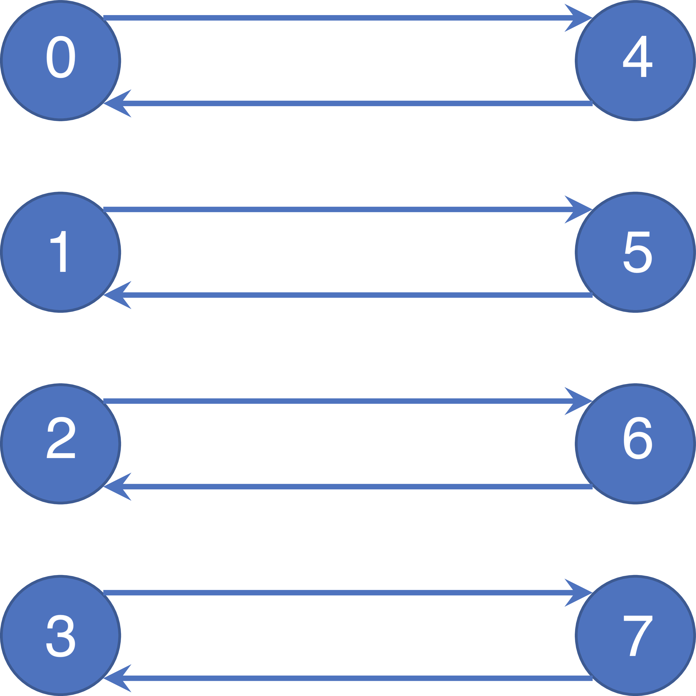

# Overivew

## Introduction
mpiP is a light-weight profiling library for MPI applications. Because it only collects statistical information about MPI functions, mpiP generates considerably less overhead and much less data than tracing tools. All the information captured by mpiP is task-local. It only uses communication during report generation, typically at the end of the experiment, to merge results from all of the tasks into one output file.

## Download
The current version of mpiP can be accessed at https://github.com/LLNL/mpiP/releases/latest.

# Setup

## Build manually on CoolMUC2
```bash
module unload intel-mpi
module load openmpi
```

```bash
cd $HOME
git clone https://github.com/LLNL/mpiP.git
cd mpiP

export UNWIND_LIB=/dss/dsshome1/lrz/sys/courses/vihps/2024/tools/mpip/spack/opt/spack/linux-sles15-haswell/gcc-11.2.0/libunwind-1.6.2-vlhsvxtgnqkgfun7rzybup375a6jfv3m/lib
export UNWIND_INC=/dss/dsshome1/lrz/sys/courses/vihps/2024/tools/mpip/spack/opt/spack/linux-sles15-haswell/gcc-11.2.0/libunwind-1.6.2-vlhsvxtgnqkgfun7rzybup375a6jfv3m/include

./configure CC=mpicc F77=mpifort CFLAGS="-g -I$UNWIND_INC" LDFLAGS="-L$UNWIND_LIB"

make
```

## Pre-built library with spack (alternative setup)
```bash
module unload intel-mpi
module use /dss/dsshome1/lrz/sys/courses/vihps/2024/tools/mpip/spack/share/spack/modules/linux-sles15-haswell
module load mpip

export MPIP_LIB_PATH=/dss/dsshome1/lrz/sys/courses/vihps/2024/tools/mpip/spack/opt/spack/linux-sles15-haswell/gcc-11.2.0/mpip-3.5-7ug4u7cdsdto4s6xr42bbc7wbxtcazh6/lib
```

## Build with spack (alternative setup) 
```bash
git clone -c feature.manyFiles=true https://github.com/spack/spack.git
cd spack/bin

module unload intel-mpi
module load gcc
spack compiler add

./spack install zlib
./spack -d install -v mpip %gcc@11.2.0
./spack load mpip
```

# Demo

## Demo #1

ping pong: sending a payload between pairs of the processes (`-np`) in multiple rounds (`-i`) 

{:.image_class width="40%"}

build on the front end
```bash
mpicc -o demo1 -O0 -g demo1.c
```

run on a compute node
```bash
module load salloc_conf/cm2_tiny
salloc -J mpip-hands-on --nodes=1 --partition=cm2_tiny --time 00:30:00 --reservation=hhps1s24
setarch `uname -m` -R /bin/bash
LD_PRELOAD=$HOME/mpiP/libmpiP.so mpirun --map-by socket --bind-to hwthread --report-bindings -np 8 ./demo1 -i 10 -p

setarch `uname -m` -R /bin/bash
LD_PRELOAD=$HOME/mpiP/libmpiP.so mpirun --map-by socket --bind-to hwthread --report-bindings -np 8 ./demo1 -i 10 -p
cat $(ls -t | head -n1)

LD_PRELOAD=$HOME/mpiP/libmpiP.so MPIP="-k 3 -n -y" mpirun --map-by socket --bind-to hwthread --report-bindings -np 8 ./demo1 -i 10 -p
cat $(ls -t | head -n1)

LD_PRELOAD=$HOME/mpiP/libmpiP.so MPIP="-k 5 -n -y" mpirun --map-by socket --bind-to hwthread --report-bindings -np 8 ./demo1 -i 10000
cat $(ls -t | head -n1)

LD_PRELOAD=$HOME/mpiP/libmpiP.so MPIP="-k 5 -n -y -s4096" mpirun --map-by socket --bind-to hwthread --report-bindings -np 8 ./demo1 -i 10000
cat $(ls -t | head -n1)
```

## Demo #2
ring communication: sending a payload to next neighbor rank (`rank+1`) in multiple rounds (`-i`) 

build on the front end
```bash
mpicc -o demo2 -O0 -g demo2.c
```

run on a compute node
```bash
module load salloc_conf/cm2_tiny
salloc -J mpip-hands-on --nodes=1 --partition=cm2_tiny --time 00:30:00 --reservation=hhps1s24
setarch `uname -m` -R /bin/bash
LD_PRELOAD=$HOME/mpiP/libmpiP.so MPIP="-k 8 -n -s40960 -y -c -z" mpirun --map-by slot --bind-to hwthread --report-bindings -np 8 ./demo2
```

## Demo #3
build on the front end
```bash
cd $HOME
git clone https://github.com/forresti/osu-micro-benchmarks.git
cd osu-micro-benchmarks/
./configure CC=mpicc CXX=mpicxx
make # by default compilation with debug information is enabled
```

run on the compute node
```bash
salloc -J mpip-hands-on --nodes=1 --partition=cm2_tiny --time 00:30:00 --reservation=hhps1s24

LD_PRELOAD=$HOME/mpiP/libmpiP.so MPIP="-k 5 -n -s4096 -y -c" mpirun --map-by slot --bind-to hwthread --report-bindings -np 56 ./mpi/pt2pt/osu_mbw_mr
cat $(ls -t | head -n1)

LD_PRELOAD=$HOME/mpiP/libmpiP.so MPIP="-k 5 -n -s4096 -y" mpirun --map-by socket --bind-to hwthread --report-bindings -np 2 ./mpi/one-sided/osu_get_bw
cat $(ls -t | head -n1)

LD_PRELOAD=$HOME/mpiP/libmpiP.so MPIP="-k 5 -n -s4096 -y -c" mpirun --map-by slot --bind-to hwthread --report-bindings -np 56 ./mpi/collective/osu_ialltoallv
cat $(ls -t | head -n1)

LD_PRELOAD=$HOME/mpiP/libmpiP.so MPIP="-k 5 -n -s4096 -y -c" mpirun --map-by slot --bind-to hwthread --report-bindings -np 56 ./mpi/collective/osu_ibarrier
```

## Demo #4
build on the front end
```bash
git clone https://github.com/LLNL/LULESH.git
sed -i 's/mpig++/mpicxx/g' Makefile
make # by default compilation with debug information is enabled
```

run on the compute node
```bash
salloc -J mpip-hands-on --nodes=1 --partition=cm2_tiny --time 00:30:00 --reservation=hhps1s24
OMP_NUM_THREADS=1 LD_PRELOAD=$HOME/mpiP/libmpiP.so MPIP="-k 5 -n -s4096 -y -c" mpirun --map-by slot --bind-to hwthread --report-bindings -np 27 ./lulesh2.0 -i 10 -p
```

# References:
* [https://software.llnl.gov/mpiP/](https://software.llnl.gov/mpiP/)